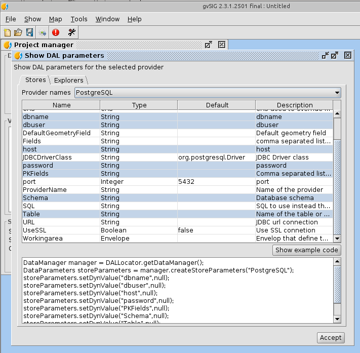
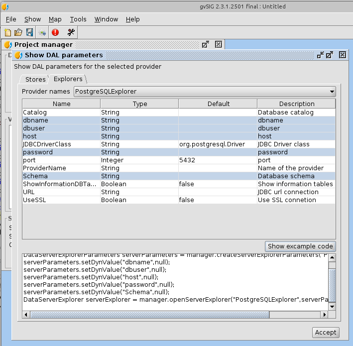
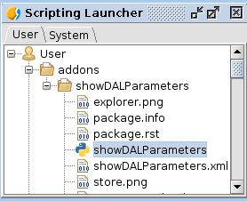

 
Descripcion
===================

Se trata de una utilidad para desarrolladores que permite
ver los parametros que son necesarios para abrir un *"store"* o
un *"server explorer"*.

Nos permite visualizar:

- El nombre de parametro
- El tipo de este
- El valor por defecto que tiene
- Su descripcion.

Una vez estamos viendo la lista de los parametros para un
proveedor dado, podemos seleccionar algunos de ellos e 
indicar que nos muestre un pequeño fracmento de codigo 
para ver como se abriria ese *"store"* o *"server explorer"*,
que podremos copia y pegar en nuestro codigo para solo
rellenar los datos que falten.

   Parametros de carga de un store de PostgreSQL

  
   Parametros de carga de un explorer de PostgreSQL

Una vez instalado esta utilidad a traves del administrador de
complementos puede acceder a ella desde el lanzador (launcher)
de scripts que se encuentra en

  Herramientas -> Scripting -> Lanzador de scripts
  

